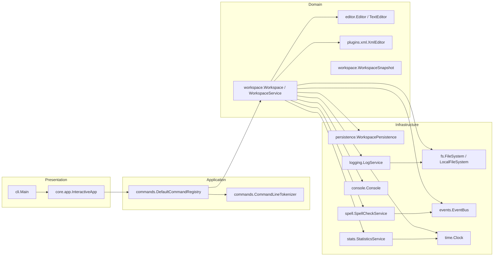

# Lab2 架构设计文档

本文档按实验要求组织：系统架构、核心设计、运行说明、测试文档。

## 2.1 系统架构

### 模块划分图



### 模块职责说明

- **CLI 交互层（`Main` + `InteractiveApp`）**
  - 负责 REPL 交互，读取命令并输出结果。
- **命令层（`DefaultCommandRegistry`）**
  - 解析命令并分发到工作区接口。
- **工作区层（`WorkspaceService`）**
  - 管理打开文件、活动文件、MRU 顺序与保存/关闭/退出等命令。
  - 根据文件类型选择编辑器（`TextEditor` 或 `XmlEditor`）。
- **编辑器层**
  - `TextEditor`：纯文本编辑与 undo/redo。
  - `XmlEditor`：XML 结构编辑与树形显示。
- **插件层（plugins）**
  - `plugins.xml` 包管理 XML 插件，实现 XML 解析、序列化与编辑逻辑。
- **基础设施层**
  - 文件系统、日志、事件总线、时钟、拼写检查服务与统计服务。

### 模块依赖关系（依赖倒置）

- 上层依赖抽象接口，不依赖实现：
  - 工作区依赖 `FileSystem`、`LogService`、`SpellCheckService`、`EventBus`、`Clock` 等。
  - 拼写检查通过 `SpellCheckService` 接口注入。
- 插件以独立包管理，满足扩展性要求。

### 对插件结构的支持

- 插件模块在 `edu.lab.plugins.*` 命名空间中独立组织。
- 新类型编辑器可通过 `WorkspaceService.createEditor(...)` 挂接，无需修改命令层。

## 2.2 核心设计

### 设计模式应用说明

- **命令模式（Command）**
  - `DefaultCommandRegistry` 将字符串命令映射到处理器，统一分发。
  - `XmlEditor` 使用命令对象记录 XML 编辑操作，支持 undo/redo。
- **组合模式（Composite）**
  - XML 结构由 `XmlElement`/`XmlText` 组成，形成树形结构。
- **装饰器模式（Decorator）**
  - `LoggableEditorDecorator` 增强日志开关。
  - `ModifiedEditorDecorator` 自动维护修改状态。
  - `SpellCheckEditorDecorator` 注入拼写检查能力。
- **观察者模式（Observer）**
  - `StatisticsService` 订阅编辑器激活/取消激活事件，统计时长。
- **适配器模式（Adapter）**
  - `SpellCheckService` 通过 `DictionarySpellCheckAdapter` 适配不同拼写检查实现。

### 其他设计说明

- XML 使用 `id -> element` 索引加速定位，满足编辑命令定位需求。
- 统计与拼写检查为横切功能，通过事件与装饰器解耦核心逻辑。

## 2.3 运行说明

- **JDK**：17+
- **构建工具**：Maven 3.9+
- **编码**：UTF-8

### 安装依赖

```bash
mvn package
```

### 运行程序

```bash
java -jar target/lab1-cli-editor-1.0.0.jar
```

### 运行测试

```bash
mvn test
```

## 2.4 测试文档

- **命令层**：命令清单回归测试，覆盖新增 XML 命令。
- **工作区层**：load/save/exit/restore 等关键流程测试。
- **编辑器层**：文本编辑与撤销重做逻辑测试。
- **基础设施层**：文件系统、日志、事件总线与持久化测试。

**测试执行结果**：`mvn test` 全部通过后为成功。
