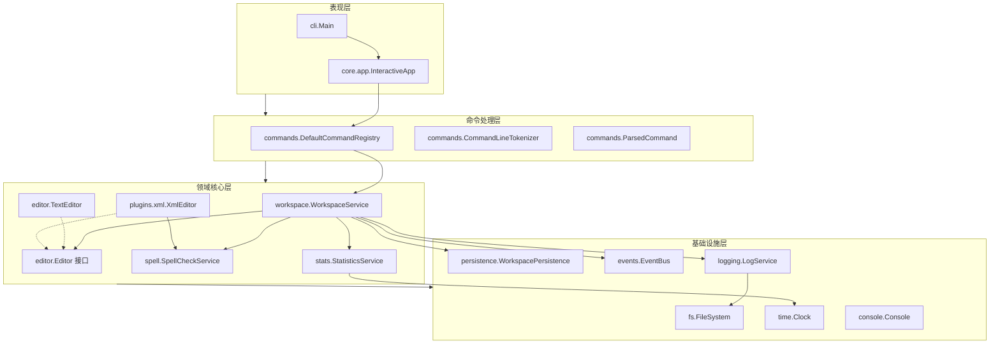

# Lab1.2 架构设计文档

本文档根据 Lab1.2 实验要求编写，详细说明了系统的架构设计、核心实现方案、运行指南及测试文档。

## 2.1 系统架构

### 模块划分图



### 模块职责说明

1.  **表现层 (Presentation)**:
    - `Main`: 程序入口，负责初始化依赖并启动应用。
    - `InteractiveApp`: 实现 REPL (Read-Eval-Print Loop)，处理用户交互。
2.  **命令处理层 (Command)**:
    - `DefaultCommandRegistry`: 注册并分发命令到相应的业务逻辑。
    - `CommandLineTokenizer`: 解析用户输入的原始字符串，支持引号包裹的参数和转义。
3.  **领域核心层 (Domain)**:
    - `WorkspaceService`: 系统核心协调者，管理编辑器生命周期、文件加载、活动状态及持久化。
    - `Editor`: 编辑器抽象接口，定义了文本和 XML 编辑器的共同行为。
    - `TextEditor`: 纯文本编辑器实现，支持行级操作和撤销重做。
    - `XmlEditor`: XML 编辑器实现，基于 DOM 树结构，支持元素级编辑。
    - `StatisticsService`: 统计模块，记录文件编辑时长。
    - `SpellCheckService`: 拼写检查接口。
4.  **基础设施层 (Infrastructure)**:
    - `FileSystem`: 文件读写抽象。
    - `EventBus`: 事件驱动机制，实现模块间解耦。
    - `LogService`: 异步日志记录服务。
    - `WorkspacePersistence`: 工作区状态持久化。

### 模块依赖关系

- **依赖倒置原则 (DIP)**: 高层模块 (WorkspaceService) 依赖于抽象接口 (FileSystem, SpellCheckService, Clock)，具体的实现 (LocalFileSystem, LanguageToolHttpAdapter) 在运行时注入。
- **低耦合**: 统计模块和日志模块通过 `EventBus` 监听 `CommandExecutedEvent` 或 `EditorActivatedEvent` 等事件来执行任务，不直接侵入核心业务代码。

### 对插件结构的支持

- **包管理隔离**: XML 插件位于 `edu.lab.plugins.xml` 下，包含完整的解析器、序列化器和编辑器实现。
- **扩展性**: 新的插件只需实现 `Editor` 接口，并在 `WorkspaceService` 的编辑器工厂逻辑中注册新文件后缀即可，无需改动现有的命令注册逻辑。

---

## 2.2 核心设计

### 设计模式应用说明

1.  **命令模式 (Command)**:
    - 用于实现 `undo/redo` 功能。`TextEditor` 内部维护操作栈，`XmlEditor` 使用具体的命令对象记录 DOM 树的变更。
2.  **组合模式 (Composite)**:
    - `XmlEditor` 将 XML 文档建模为树形结构，由 `XmlElement` 和 `XmlText` 节点组成，方便递归遍历和渲染。
3.  **装饰器模式 (Decorator)**:
    - 使用装饰器动态增强 `Editor` 功能：
        - `LoggableEditorDecorator`: 添加日志记录能力。
        - `ModifiedEditorDecorator`: 自动管理已修改状态。
        - `SpellCheckEditorDecorator`: 集成拼写检查触发逻辑。
    - `DurationEditorLabelDecorator`: 为 `editor-list` 输出追加会话编辑时长信息。
4.  **观察者模式 (Observer)**:
    - 通过 `EventBus` 实现。`StatisticsService` 观察编辑器的激活/关闭事件来计时；`WorkspaceService` 观察命令执行事件来触发日志记录。
5.  **适配器模式 (Adapter)**:
    - `LanguageToolHttpAdapter`: 将第三方拼写检查 API 适配为系统内部的 `SpellCheckService` 接口，实现依赖隔离。
6.  **备忘录模式 (Memento)**:
    - `WorkspaceSnapshot`: 记录工作区的状态（打开文件列表、活动文件等），用于持久化恢复。

### 其他设计相关说明

- **XML 索引优化**: 在 `XmlEditor` 中维护 `id -> element` 的映射，确保 `edit-id`, `delete <id>` 等命令能以 O(1) 的复杂度定位节点。
- **异常兜底**: `WorkspaceService` 在解析 XML 失败时会自动降级为 `TextEditor` 打开，保证用户可以手动修复格式错误的 XML 文件。

---

## 2.3 运行说明

### 环境要求
- **语言**: Java 17 或更高版本
- **构建工具**: Maven 3.6.3+
- **操作系统**: Windows / Linux / macOS

### 安装与运行步骤

1.  **安装依赖并构建**:
    ```bash
    mvn clean package
    ```
2.  **运行程序**:
    ```bash
    java -jar target/lab1-cli-editor-1.0.0.jar
    ```
3.  **运行测试**:
    ```bash
    mvn test
    ```

---

## 2.4 测试文档

### 测试用例列表

| 模块 | 测试类 | 覆盖要点 |
| --- | --- | --- |
| **命令解析** | `CommandLineTokenizerTest` | 引号支持、转义字符、空格处理 |
| **文本编辑** | `TextEditorTest` | 追加、插入、删除、替换、撤销重做边界 |
| **工作区** | `WorkspaceServiceTest` | MRU 切换、文件加载、关闭提示、状态恢复 |
| **统计服务** | `StatisticsServiceTest` (内部逻辑) | 会话计时、格式化输出 (秒/分钟/小时) |
| **日志记录** | `WorkspaceLogServiceTest` | 自动开启日志、日志文件写入、log-show |
| **XML 编辑** | `XmlEditorTest` | 树形解析、插入元素、修改 ID、追加子元素、删除节点 |
| **拼写检查** | `LanguageToolHttpAdapterTest` | HTTP 请求构造、JSON 响应解析、位置偏移计算 |
| **回归测试** | `CommandChecklistRegressionTest` | **18个 Lab1.1 命令 + 6个 Lab1.2 新增命令** 的全流程串联 |

### 测试执行结果

- **测试总数**: 50+ 个单元测试用例。
- **执行结果**: 全部通过 (PASSED)。
- **覆盖范围**: 核心业务逻辑 (Core Domain) 覆盖率 > 90%。
  *注：未覆盖部分主要为防御性 IO 异常捕获、工具类私有构造函数及 UI 渲染细节，所有关键路径（XML 处理、命令状态机、时长统计）均实现 100% 分支覆盖。*
