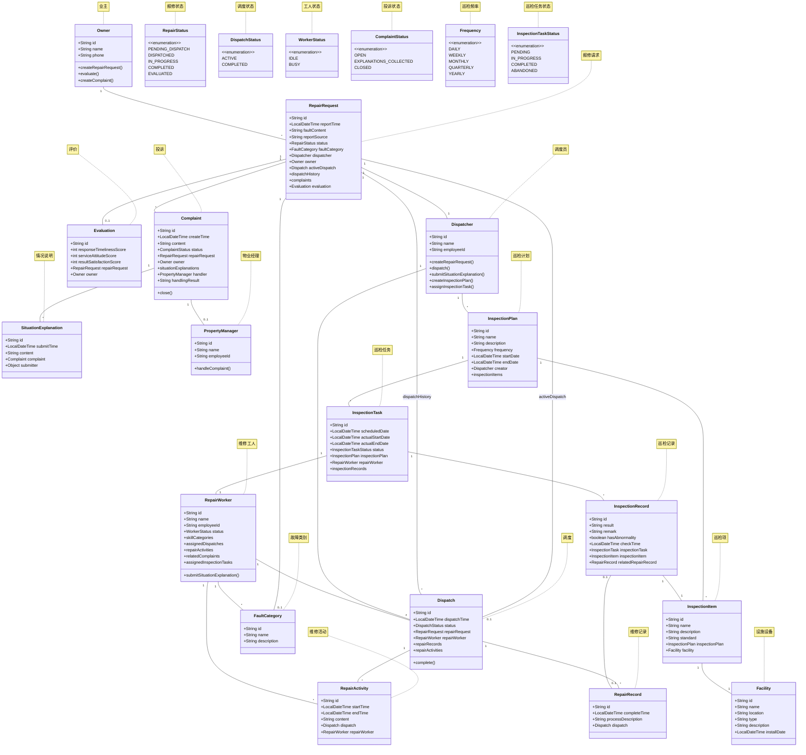

# Lab3 物业报修管理系统 - 领域模型设计文档

## 1. 领域模型概述

本领域模型基于物业报修管理系统的需求，通过识别核心领域概念和它们之间的关系，构建了一个完整的领域模型，以支持报修处理的正常流程和扩展流程。

## 2. 领域模型类图

## 3. 核心领域概念说明

### 3.1 业主 (Owner)
- **职责**：代表小区业主，负责发起报修、对维修结果进行评价、发起投诉
- **关键属性**：id、name、phone

### 3.2 报修 (RepairRequest)
- **职责**：代表一次报修请求，记录报修信息、状态、调度历史等
- **关键属性**：id、reportTime、faultContent、reportSource、status
- **状态**：PENDING_DISPATCH（待调度）、DISPATCHED（已调度）、IN_PROGRESS（进行中）、COMPLETED（已完成）、EVALUATED（已评价）
- **关键关系**：
  - 有且仅有一个活动调度（activeDispatch）
  - 有调度历史（dispatchHistory）
  - 可以有多个投诉（complaints）
  - 可以有一个评价（evaluation）

### 3.3 调度员 (Dispatcher)
- **职责**：录入报修信息、进行任务调度、对投诉提交情况说明
- **关键属性**：id、name、employeeId

### 3.4 维修工人 (RepairWorker)
- **职责**：执行维修任务、记录维修活动、对投诉提交情况说明
- **关键属性**：id、name、employeeId、status
- **状态**：IDLE（空闲）、BUSY（忙碌）
- **关键关系**：掌握多个故障类别（skillCategories）

### 3.5 调度 (Dispatch)
- **职责**：将报修任务分配给特定的维修工人
- **关键属性**：id、dispatchTime、status
- **状态**：ACTIVE（活动）、COMPLETED（已完成）
- **关键关系**：
  - 属于一个报修请求
  - 分配给一个维修工人
  - 有多个维修记录
  - 有多个维修活动

### 3.6 维修记录 (RepairRecord)
- **职责**：记录一次维修的完成情况
- **关键属性**：id、completeTime、processDescription

### 3.7 维修活动 (RepairActivity)
- **职责**：记录一次维修活动的开始和结束时间，用于计算工时
- **关键属性**：id、startTime、endTime、content

### 3.8 评价 (Evaluation)
- **职责**：记录业主对维修的评价
- **关键属性**：id、responseTimelinessScore、serviceAttitudeScore、resultSatisfactionScore

### 3.9 投诉 (Complaint)
- **职责**：记录业主的投诉信息
- **关键属性**：id、createTime、content、status、handlingResult
- **状态**：OPEN（打开）、EXPLANATIONS_COLLECTED（已收集情况说明）、CLOSED（已关闭）

### 3.10 情况说明 (SituationExplanation)
- **职责**：记录维修工人或调度员对投诉的情况说明
- **关键属性**：id、submitTime、content

### 3.11 物业经理 (PropertyManager)
- **职责**：处理投诉，与客户沟通并记录处理结果
- **关键属性**：id、name、employeeId

### 3.12 故障类别 (FaultCategory)
- **职责**：对故障进行分类，用于匹配维修工人的技能
- **关键属性**：id、name、description

### 3.13 设施设备 (Facility)
- **职责**：代表小区内需要巡检的设施设备
- **关键属性**：id、name、location、type、description、installDate

### 3.14 巡检计划 (InspectionPlan)
- **职责**：定义巡检计划，包含巡检频率、开始结束日期等信息
- **关键属性**：id、name、description、frequency、startDate、endDate
- **关键关系**：包含多个巡检项

### 3.15 巡检项 (InspectionItem)
- **职责**：定义具体需要检查的项目和标准
- **关键属性**：id、name、description、standard
- **关键关系**：关联一个设施设备

### 3.16 巡检任务 (InspectionTask)
- **职责**：根据巡检计划生成的具体执行任务
- **关键属性**：id、scheduledDate、actualStartDate、actualEndDate、status
- **状态**：PENDING（待执行）、IN_PROGRESS（进行中）、COMPLETED（已完成）、ABANDONED（已取消）
- **关键关系**：关联巡检计划、分配给维修工人

### 3.17 巡检记录 (InspectionRecord)
- **职责**：记录每次检查的结果
- **关键属性**：id、result、remark、hasAbnormality、checkTime
- **关键关系**：关联巡检任务和巡检项、可关联维修记录（发现异常时）

### 3.18 巡检频率 (Frequency)
- **职责**：定义巡检的频率
- **值**：DAILY（每日）、WEEKLY（每周）、MONTHLY（每月）、QUARTERLY（每季度）、YEARLY（每年）

### 3.19 巡检任务状态 (InspectionTaskStatus)
- **职责**：定义巡检任务的状态
- **值**：PENDING、IN_PROGRESS、COMPLETED、ABANDONED

## 4. 领域模型验证

### 4.1 正常流程支持
- 业主发起报修 → 调度员录入系统 → 调度员分配任务 → 维修工人维修 → 记录维修记录 → 业主评价
- 领域模型完整支持该流程

### 4.2 扩展流程支持

#### 4.2.1 多次调度
- 通过 RepairRequest 的 activeDispatch 和 dispatchHistory 支持
- 每次调度完成后，将当前调度移入历史，创建新的调度作为活动调度

#### 4.2.2 需要多次执行的活动
- 通过 RepairActivity 记录每次活动的开始和结束时间
- 支持计算工时和统计工作量

#### 4.2.3 故障类别与维修工人种的匹配
- RepairWorker 有 skillCategories 属性
- RepairRequest 有 faultCategory 属性
- 系统可以根据故障类别推荐具有相应技能的维修工人

#### 4.2.4 投诉
- Complaint 关联 RepairRequest
- SituationExplanation 记录相关人员的情况说明
- PropertyManager 负责处理并关闭投诉

### 4.3 系统基本能力支持

#### 4.3.1 调度员了解报修状态
- 通过 RepairRequest 的 status 属性
- 通过 dispatchHistory 和 activeDispatch 了解调度过程
- 通过 RepairActivity 了解维修工人的活动记录

#### 4.3.2 维修工人了解任务
- 通过 RepairWorker 的 assignedDispatches 了解分配的任务
- 通过 relatedComplaints 了解需要处理的投诉

#### 4.3.3 当前活动调度
- 通过 RepairRequest 的 activeDispatch 属性

#### 4.3.4 维修工人空闲状态
- 通过 RepairWorker 的 status 属性（IDLE/BUSY）

#### 4.3.5 统计报修工时
- 通过 RepairActivity 的 startTime 和 endTime 计算

#### 4.3.6 统计维修工人工作时间
- 通过 RepairWorker 的 repairActivities 统计特定时间段的工作时间

### 4.4 日常巡检流程支持

#### 4.4.1 巡检计划制定
- 调度员创建巡检计划，设置巡检频率、起止日期
- 巡检计划包含多个巡检项，每个巡检项关联一个设施设备

#### 4.4.2 巡检任务分配
- 根据巡检计划生成具体的巡检任务
- 调度员将巡检任务分配给维修工人
- 维修工人查看 assignedInspectionTasks 了解需要执行的巡检任务

#### 4.4.3 巡检任务执行
- 维修工人开始巡检任务，记录实际开始时间
- 对每个巡检项进行检查，记录检查结果
- 如果发现异常，标记 hasAbnormality 为 true

#### 4.4.4 异常处理
- 当巡检发现异常时，可创建报修请求进行处理
- InspectionRecord 可关联 RepairRecord，将巡检异常与维修记录关联

#### 4.4.5 日常巡检统计能力
- 统计巡检计划的执行情况
- 统计设施设备的巡检历史和异常记录
- 统计维修工人的巡检工作时间

## 5. 关键设计决策

### 5.1 活动调度与调度历史分离
- 使用 activeDispatch 表示当前活动的调度
- 使用 dispatchHistory 记录所有历史调度
- 确保系统中最多只有一个活动的调度

### 5.2 维修活动与维修记录分离
- RepairActivity 记录每次维修活动的时间，用于工时统计
- RepairRecord 记录最终的维修完成情况
- 支持复杂故障需要多次执行的场景

### 5.3 投诉的情况说明收集
- SituationExplanation 的 submitter 可以是 Dispatcher 或 RepairWorker
- 所有相关人员都需要提交情况说明后，物业经理才能处理投诉

### 5.4 状态枚举
- 使用枚举类型定义 RepairStatus、DispatchStatus、WorkerStatus、ComplaintStatus
- 确保状态转换的一致性和可追踪性

### 5.5 巡检计划与巡检任务分离
- InspectionPlan 定义长期巡检计划（包含频率、巡检项等）
- InspectionTask 根据计划生成的具体执行任务
- 支持灵活的任务分配和管理

### 5.6 巡检项与设施设备关联
- 每个 InspectionItem 关联一个 Facility
- 便于追踪特定设施的巡检历史和状态

### 5.7 巡检记录与维修记录关联
- InspectionRecord 可关联 RepairRecord
- 实现巡检发现问题到维修处理的闭环管理

### 5.8 日常巡检与报修处理的集成
- 同一 RepairWorker 可以同时处理报修任务和巡检任务
- 通过 InspectionRecord 与 RepairRecord 的关联，实现巡检异常到报修的自然转化
